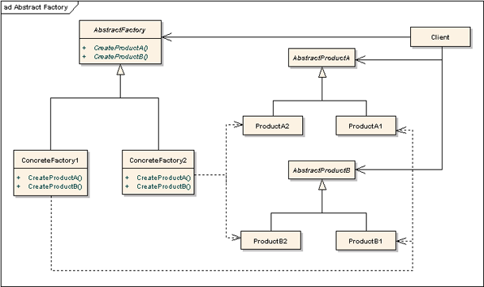

# Abstract Factory
### Creational Design Pattern

## Обобщение
Abstract Factory Pattern-ът предоставя начин, по който да се енкапсулира създаването на сходни конкретни обекти, 
без да се конкретизират техните класове.
Клиентът създава конкретна имплементация на абстрактната фабрика и я използва през абстрактния интерфейс,
за да създава конкретни обекти. Той не се интересува какъв конкретен обект получава, тъй като използва само
интерфейса на продукта.

Този шаблон разделя създаването на обект от използването му - фабриката определя конкретния обект и го създава,
но връща само абстрактен показател към конкретния обект. Това изолира клиентския код от създаването на обекта, тъй 
като клиентът получава абстрактен обект от желания тип.

Abstract Factory Pattern-ът се използва при системи, които често се изменят. Предоставя лесен и гъвкъв механизъм
за замяна на конкретни групи от обекти.

## Схема

###### Abstract Factory
~~~c#
// Abstract Factory

public class FruitStore
{
    private readonly IFruitFactory factory;

    public FruitStore(IFruitFactory factory)
    {
        this.factory = factory;
    }

    public IFruit GetFruit(FruitType type)
    {
        return factory.GetFruit(type);
    }
}
~~~

~~~c#
public class BulgarianFruitFactory : IFruitFactory
{
    ... 
    public IFruit GetFruit(FruitType type)
    {
        // implement fruit creations
    }
}
~~~

~~~c#
public class GreeceFruitFactory : IFruitFactory
{
    ... 
    public IFruit GetFruit(FruitType type)
    {
        // implement fruit creations
    }
}
~~~

~~~c#
public class SpainFruitFactory : IFruitFactory
{
    ... 
    public IFruit GetFruit(FruitType type)
    {
        // implement fruit creations
    }
}
~~~