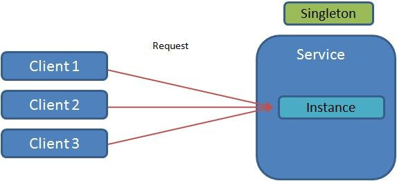

# Singleton
### Creational Design Pattern

## Обобщение
Singleton се използва, когато трябва да се гарантира, че определен клас има само една единствена инстанция.

Това е полезно, когато е непбходимо да има един единствен обект, за да може системата да си свърши работата.
Чест от девелопърите са критични и наричат Singleton anti-patern. 
Причината е, защото създава голям coupling и остава в паметта през цялото време на изпълнение.
Въпреки това някои обекти са много "скъпи" за инстанциране и/или трябва да бъдат уникални. 

Приложение: 
Abstract factory, builder и prototype patterns могат да бъдат Singleton имплементации.
Facade и State objects са често Singleton също. 
В някои езици се предпочита се пред глобалните променливи.

## Схема

###### Singleton стандартен
~~~c#
public final class Singleton {
    private static final Singleton instance = new Singleton();
    private Singleton() {}

    public static Singleton getInstance() {
        return instance;
    }
}
~~~

###### Singleton с Lazy initialization
~~~c#
public final class Singleton {
    private static Singleton instance = null;
    private Singleton() {}
    
    public static synchronized Singleton getInstance() {
        if (instance == null) instance = new Singleton();
        return instance;
    }
}
~~~

###### Singleton с Lazy initialization
~~~c#
using System;

public sealed class Singleton
{
   private static volatile Singleton instance;
   private static object syncRoot = new Object();

   private Singleton() {}

   public static Singleton Instance
   {
      get 
      {
         if (instance == null) 
         {
            lock (syncRoot) 
            {
               if (instance == null) 
                  instance = new Singleton();
            }
         }

         return instance;
      }
   }
}
~~~