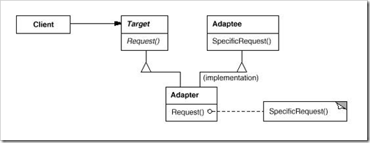

# Adapter
### Structural Design Pattern

#### Обобщение
Adapter pattern се използва, когато не съвпадат интерфейсите на 2 класа, за да си комуникират.
Може да се използва, когато единия клас има много сложен интерфейс, а другия иска да използва малка част от него само.
В примера по-долу Bank класът играе роля на адаптер, за да може потребителя да си плати сметката.

#### Схема

#### Adapter
~~~c#
public class BillInDollars : IBillInDollars
{
    ...
    IDollars Cost {get; set;}

    void PayBill (IDollars money)
    {
        // do things
    }
}
~~~

~~~c#
public class Bank
{
    private readonly IExchangeRate rate; 

    public Bank(IExchangeRate rate)
    {
        this.rate = rate;
    }

    void PayBill(IBillInDollars bill, IEuro money)
    {
        IEuro exchangedMoney = this.rate * money;

        bill.PayBill(exchangedMoney);
    }
}
~~~