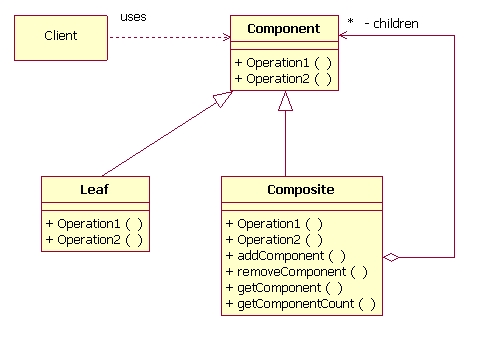

# Composite
### Structural Design Pattern

#### Обобщение

Composite pattern се използва когато трябва да се "маскира" колекция от обекти да работи като един.
Колекцията наследява същия интерфейс и понякога за потребителя остава в тайна, че всъщност работи с колекция.
Според зависи от случая едни и същи действия може да се изпълняват върху всеки член на колекцията ИЛИ 
действието да се изпълнява само от един, като за крайния потребител няма разлика във функционалността.

####S Схема

#### Composite
~~~c#
public interface IHDD
{
    IData Read();
    void Write(IData data);
}
~~~

~~~c#
public class HDD : IHDD
{
    IData Read()
    {
        // Load data
    }
    void Write(IData data)
    {
        // Save data to disk
    }
}
~~~

~~~c#
public class RAID : 
{
    private ICollection<IHDD> raid;

    public RAID()
    {
        this.raid = new List<IHDD>();
    }

    IData Read()
    {
        return this.raid.Load();
    }
    void Write(IData data)
    {
        this.raid.Save();
    }

    void Add (IHDD hard)
    {
        this.raid.Add(hard);
    }

    void Remove (IHDD hard)
    {
        this.raid.Remove(hard);
    }
}
~~~
