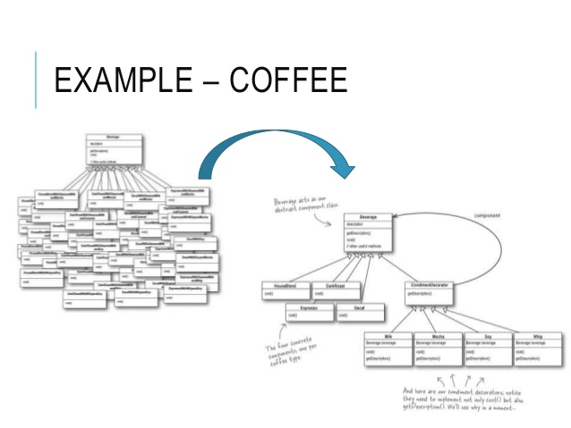

# Decorator
### Structural Design Pattern

#### Обобщение

Decorator design pattern се използва много често в обектно ориентирания дизайн. 
Подходящ е когато трябва да се добави функционалност на определен обект без да се налага да се правят дълги вериги от наследявания.
С негова помощ много лесно може да се extend-не базовия клас. 
Често се използва, когато трябва да се направят вариации от функционалностти без това да усложнява архитектурате повече от необходимото.

#### Схема

#### Decorator
~~~c#
public interface IPc
{
    void ClickKeys();
    void MoveCousor();
    void SaveData(IData data);
    void Upload(IData data);
    IData Download();
}
~~~

~~~c#
// base 
public class Pc : IPc
{
    void ClickKeys()
    {
        // excecute key press
    }

    void MoveCousor()
    {
        // excecute coursor move with arrows
    }

    void SaveData(IData data)
    {
        // save data locally
    }

    void Upload(IData data)
    {
        // upload data on local repository
    }
    IData Download()
    {
        // download data from local repository
    }
}
~~~

~~~c#
public class PcWithInternet : IPc
{
    private readonly IPc basePc; 

    public PcWithInternet (IPc pc)
    {
        this.basePc = pc;    
    }

    void ClickKeys()
    {
        basePc.ClickKeys();
    }

    void MoveCousor()
    {
        basePc.MoveCousor();
    }

    void SaveData(IData data)
    {
       basePc.SaveData(data);
    }

    void Upload(IData data)
    {
        // change functionallity and upload on Internet server
    }
    IData Download()
    {
        // change functionallity and download from Internet server
    }
}
~~~

~~~c#
public class PcWithMouse : IPc
{
    private readonly IPc basePc; 

    public PcWithMouse (IPc pc)
    {
        this.basePc = pc;    
    }

        void ClickKeys()
    {
        basePc.ClickKeys();
    }

    void MoveCousor()
    {
        //change functionallity and now click with mouse
    }

    void SaveData(IData data)
    {
        basePc.SaveData(data);
    }

    void Upload(IData data)
    {
        basePc.Upload(data);
    }
    IData Download()
    {
        basePc.Download(data);
    }
}
~~~
